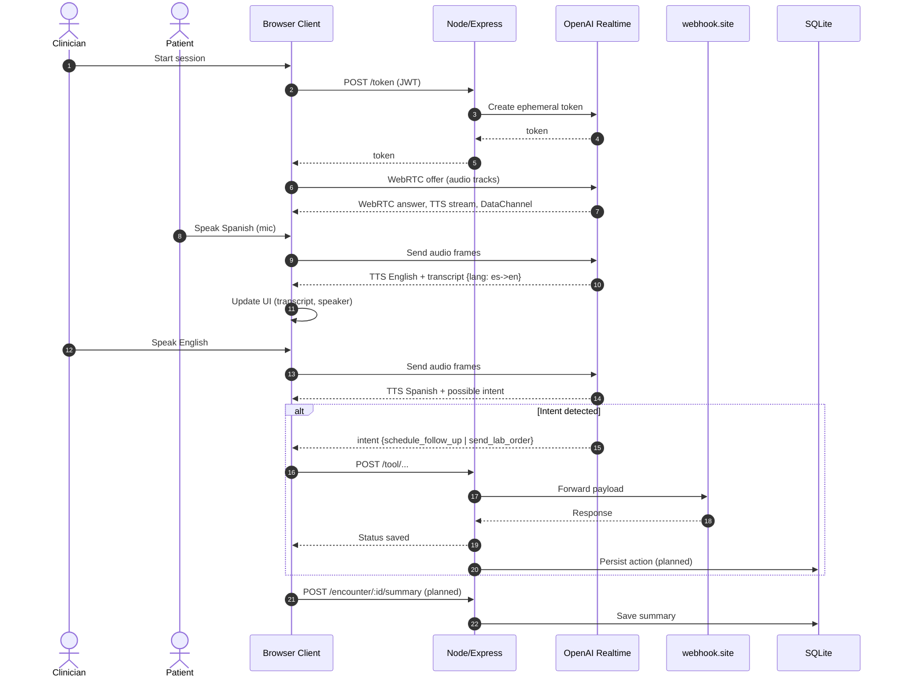

```mermaid
%% Sully Medical Translator - Live Session Sequence
sequenceDiagram
  autonumber
  actor Clinician
  actor Patient
  participant Client as Browser Client
  participant Server as Node/Express
  participant OpenAI as OpenAI Realtime
  participant Webhook as webhook.site
  participant DB as SQLite

  Clinician->>Client: Start session
  Client->>Server: POST /token (JWT)
  Server->>OpenAI: Create ephemeral token
  OpenAI-->>Server: token
  Server-->>Client: token

  Client->>OpenAI: WebRTC offer (audio tracks)
  OpenAI-->>Client: WebRTC answer, TTS stream, DataChannel

  Patient->>Client: Speak Spanish (mic)
  Client->>OpenAI: Send audio frames
  OpenAI-->>Client: TTS English + transcript {lang: es->en}
  Client->>Client: Update UI (transcript, speaker)

  Clinician->>Client: Speak English
  Client->>OpenAI: Send audio frames
  OpenAI-->>Client: TTS Spanish + possible intent

  alt Intent detected
    OpenAI-->>Client: intent {schedule_follow_up | send_lab_order}
    Client->>Server: POST /tool/...
    Server->>Webhook: Forward payload
    Webhook-->>Server: Response
    Server-->>Client: Status saved
    Server->>DB: Persist action (planned)
  end

  Client->>Server: POST /encounter/:id/summary (planned)
  Server->>DB: Save summary
```